# CSS Grid

- The CSS Grid Layout Module offers a grid-based layout system, with rows and columns
- Making it easier to design web pages without having to use floats and positioning.

## Why should we learn css grid?

- Easier to create multi dimensional layouts
- Simpler markup
- Flexible
- Frameworks not needed
- Good browser support

## Grid Elements

- A grid layout consists of a parent element, with one or more child elements


## Grid Columns

- The vertical lines of grid items are called _Columns_


## Grid Rows

- The horizontal lines of grid items are called _Rows_


## Grid Gaps

- The spaces between each column/row are called _Gaps_


- I can adjust the gap size by using the following properties -
  - `column-gap`
  - `row-gap`
  - `gap` - Shorthand

## Grid Lines

- The lines between columns are called _Column Lines_
- The lines between rows are called _Row Lines_


## Row Height


## Column Width


## Use of Grid

- HTML setup -

```html
<div class="container">
  <div>1</div>
  <div>2</div>
  <div>3</div>
  <div>4</div>
  <div>5</div>
  <div>6</div>
</div>
```

### Columns

- 2 columns in grid using `grid-template-columns` -
- Per column width `100px` and height adjusted

```css
.container {
  display: grid;
  grid-template-columns: 100px 100px;
}
```


- 3 columns in grid using `grid-template-columns` -
- Per column width provided `200px`, `100px` & `150px` respectively and height adjusted by webpage

```css
.container {
  display: grid;
  grid-template-columns: 200px 100px 150px;
}
```


- I can create many more columns similarly
- 2 rows in grid using `grid-template-rows` -

```css
.container {
  display: grid;
  grid-template-columns: 200px 100px;
  grid-template-rows: 50px 100px;
}
```

### Rows


- I didn't mention 3rd row's value so that it can use default one
- But 1st row is `50px` & 2nd row is `100px`
- I can create many more rows similarly
- Making responsive using `auto` -

```css
.container {
  display: grid;
  grid-template-columns: 200px auto;
  grid-template-rows: 50px 100px;
}
```


- `auto` means if total width is `500px` and 1st column's width `200px` then 2nd column will be `500px - 200px = 300px` which calculated automatically
- If I resize my browser window then the 2nd column's width will be resize accordingly


### Gaps

- Create gap according to rows and columns

```css
.container {
  display: grid;
  grid-template-columns: 200px auto;
  grid-template-rows: 50px 100px;
  grid-row-gap: 2px;
  grid-column-gap: 5px;
}
```


- Also working (recommended) -

```css
.container {
  display: grid;
  grid-template-columns: 200px auto;
  grid-template-rows: 50px 100px;
  row-gap: 2px; /* Use instead of 'grid-row-gap' */
  column-gap: 5px; /* Use instead of 'grid-column-gap' */
}
```

- If same amount will be provided for giving gap in row and column -

```css
.container {
  display: grid;
  grid-template-columns: 200px auto;
  grid-template-rows: 50px 100px;
  grid-gap: 10px;
}
```


- Also working (recommended) -

```css
.container {
  display: grid;
  grid-template-columns: 200px auto;
  grid-template-rows: 50px 100px;
  gap: 10px; /* Use instead of 'grid-gap' */
}
```

### Fractional Units & Repeat

- Which creates fully responsive webpage

```css
.container {
  display: grid;
  grid-template-columns: 1fr 2fr;
}
```


- Total = `1 fr + 2fr = 3fr` amount size
- 1st column takes 1/3 portion
- 2nd column takes 2/3 portion
- Resize according to browser window size

\

- Same concept will go for rows

```css
.container {
  display: grid;
  grid-template-columns: 1fr 2fr;
  grid-template-rows: 2fr 3fr;
}
```


- Shorthand -

```css
grid-template: row / column;
```

- For example:

```css
.container {
  display: grid;
  grid-template: 2fr 3fr / 1fr 2fr; /* row / column */
}
```

- Outcome will the same as before
- If 3 columns or 3 rows take same amount of value -

```css
.container {
  display: grid;
  grid-template-columns: repeat(3, 1fr);
  grid-template-rows: repeat(3, fr);
}
```


- Shorthand -

```css
.container {
  display: grid;
  grid-template: repeat(3, 1fr) / repeat(3, 1fr);
}
```


### Positioning items

- Define start and end
- In HTML setup -

```html
<div class="container">
  <div class="header">Header</div>
  <div class="menu">Menu</div>
  <div class="content">Content</div>
  <div class="footer">Footer</div>
</div>
```

- widened 1st column - take 2 columns space

```css
.container {
  display: grid;
  grid-template-columns: 1fr 1fr;
}

.header {
  grid-column-start: 1; /* Start from line 1 */
  grid-column-end: 3; /* end till line 3 */
}
```


- Alternative way -

```css
.header {
  grid-column-start: 1; /* Start from line 1 */
  grid-column-end: span 2; /* span for 2 columns space */
}
```

- Shorthand (Use 01) -

```css
.header {
  grid-column: 1 / 3; /* Start / end */
}
```

- Shorthand (Use 02) -

```css
.header {
  grid-column: 1 / span 2; /* Start / end */
}
```

- Use of -ve value -

```css
.container {
  display: grid;
  grid-template-columns: 1fr 1fr;
}

.header {
  grid-column: 1 / span 2; /* Start / end */
}

.footer {
  grid-column: 1 / -1; /* -1 means columns line will start from right->left */
}
```


- But convention is to make column 12 portion and provide a height to make `grid-templete-rows` workable

```css
.container {
  height: 100%;
  display: grid;
  grid-template-columns: repeat(12, 1fr); /* Standard grid: 12 portion */
  grid-template-rows: 50px auto 50px; /* Also workable - 50px 1fr 50px */
}

.header {
  grid-column: 1 / -1;
}

.content {
  grid-column: 2 / -1;
}

.footer {
  grid-column: 1 / -1;
}
```


- Row customization -

```css
.container {
  height: 100%;
  display: grid;
  grid-template-columns: repeat(12, 1fr); /* Standard grid: 12 portion */
  grid-template-rows: 50px auto 50px; /* Also workable - 50px 1fr 50px */
}

.header {
  grid-column: 2 / -1;
}

.content {
  grid-column: 2 / -1;
}

.footer {
  grid-column: 1 / -1;
}

.menu {
  grid-row-start: 1;
  grid-row-end: -2;
}
```


### `grid-template-areas`

- Visually design using `grid-template-areas`
- Design in `grid-template-areas`
- Denote that symbol using `grid-area` in specific field

```css
.container {
  height: 100%;
  display: grid;
  grid-template-columns: repeat(12, 1fr);
  grid-template-rows: 50px auto 50px;
  grid-template-areas:
    'h h h h h h h h h h h h'
    'm m c c c c c c c c c c'
    'f f f f f f f f f f f f';
}

.header {
  grid-area: h;
}

.menu {
  grid-area: m;
}

.content {
  grid-area: c;
}

.footer {
  grid-area: f;
}
```

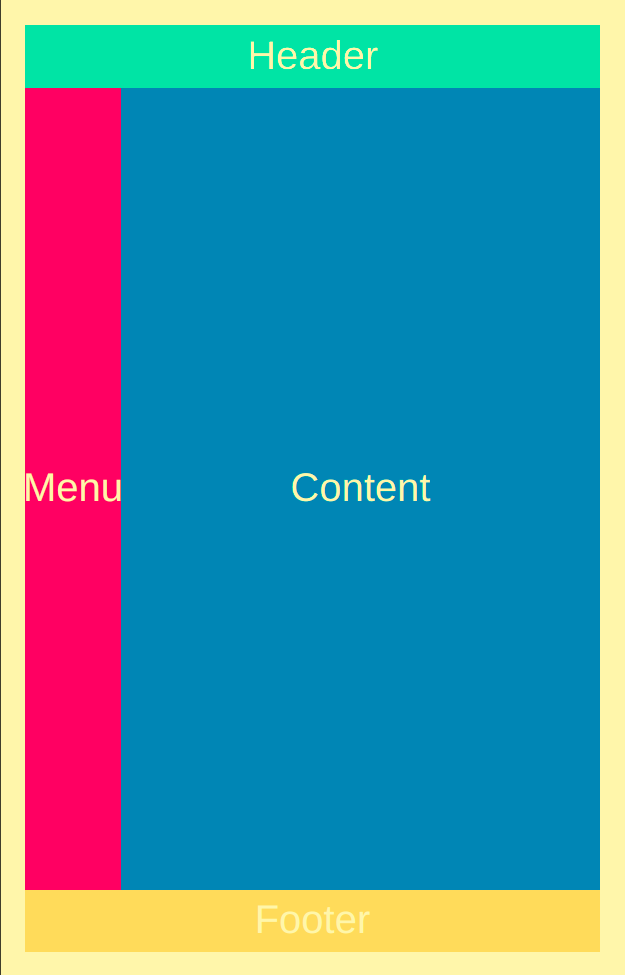

- If I want to skip any part then -

```css
.container {
  height: 100%;
  display: grid;
  grid-template-columns: repeat(12, 1fr);
  grid-template-rows: 50px auto 50px;
  grid-template-areas:
    'h h h h h h h h h . . .'
    'm m c c c c c c c c c c'
    '. . f f f f f f f f f f';
}

.header {
  grid-area: h;
}

.menu {
  grid-area: m;
}

.content {
  grid-area: c;
}

.footer {
  grid-area: f;
}
```

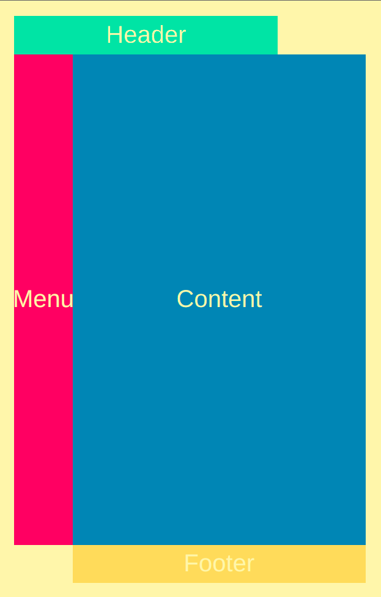

### `auto-fit` & `minmax()` function

- Column will be 5 and row will be 2
- In HTML setup -

```html
<div class="container">
  <div>1</div>
  <div>2</div>
  <div>3</div>
  <div>4</div>
  <div>5</div>
  <div>6</div>
  <div>7</div>
  <div>8</div>
  <div>9</div>
  <div>10</div>
</div>
```

- In CSS -

```css
.container {
  height: 100%;
  display: grid;
  grid-template-columns: repeat(5, 90px);
  grid-template-rows: repeat(2, 1fr);
}
```

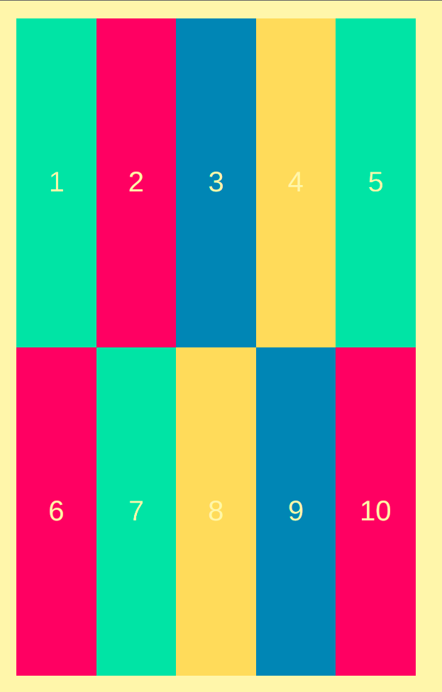

- _Problem:_ If I resize the window, free space in right side.

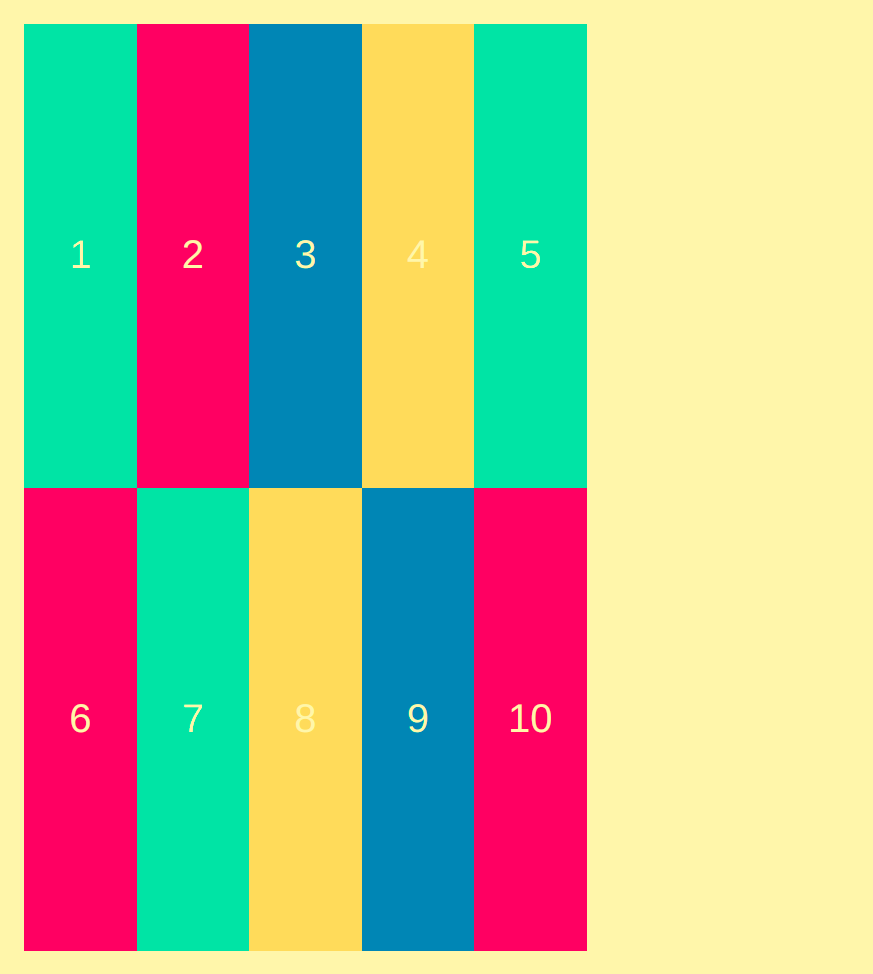

- _Workaround:_ using `auto-fit` I can solve it
- If I have `<90px` area then it should be empty
- If I have `>90px` area then one more portion will be replaced coming from down element

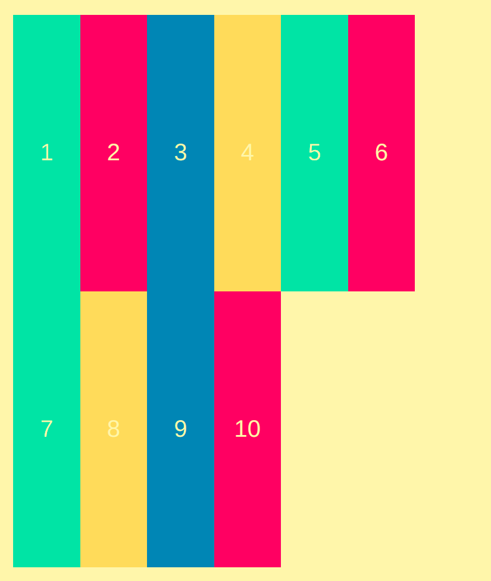

- If I resize the window then I can see the proper example -

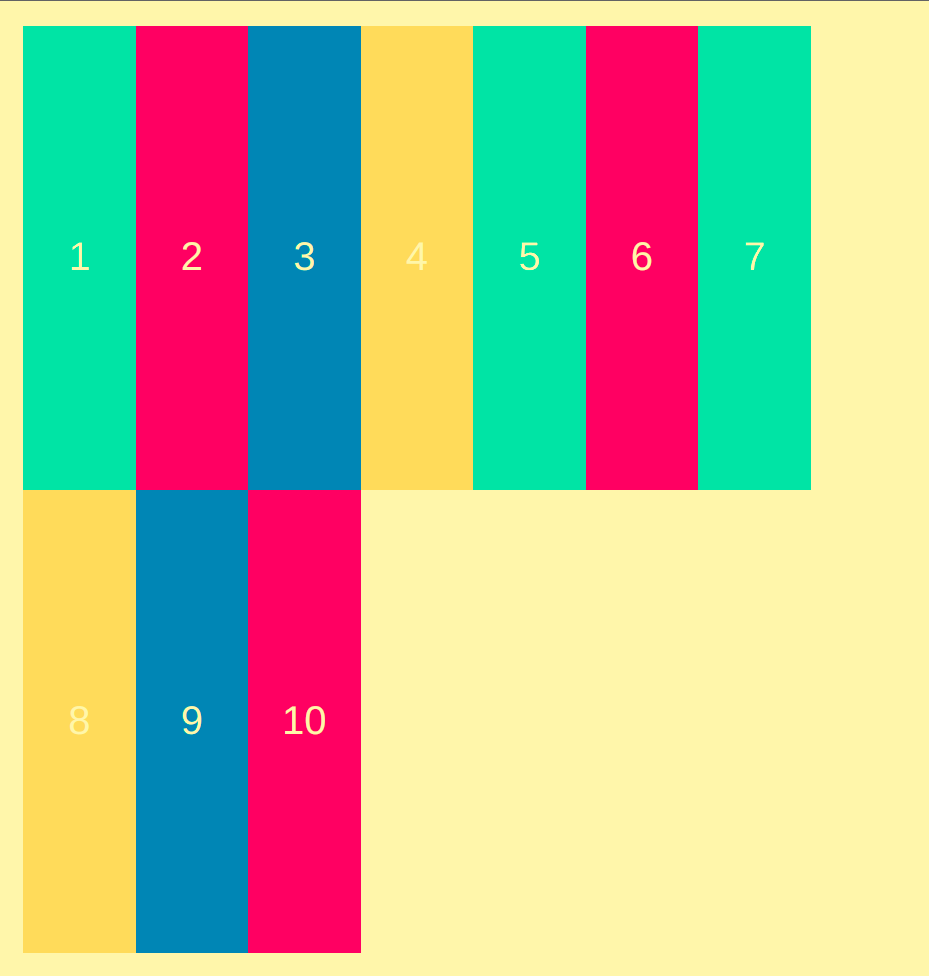

- _Problem:_ Previous picture, if `<90px` then few area is empty
- _Workaround:_ Solve using `minmax()` function
- Expand will work between `90px` to `1fr`
- Basically, if empty space is `<90px` then expand the element

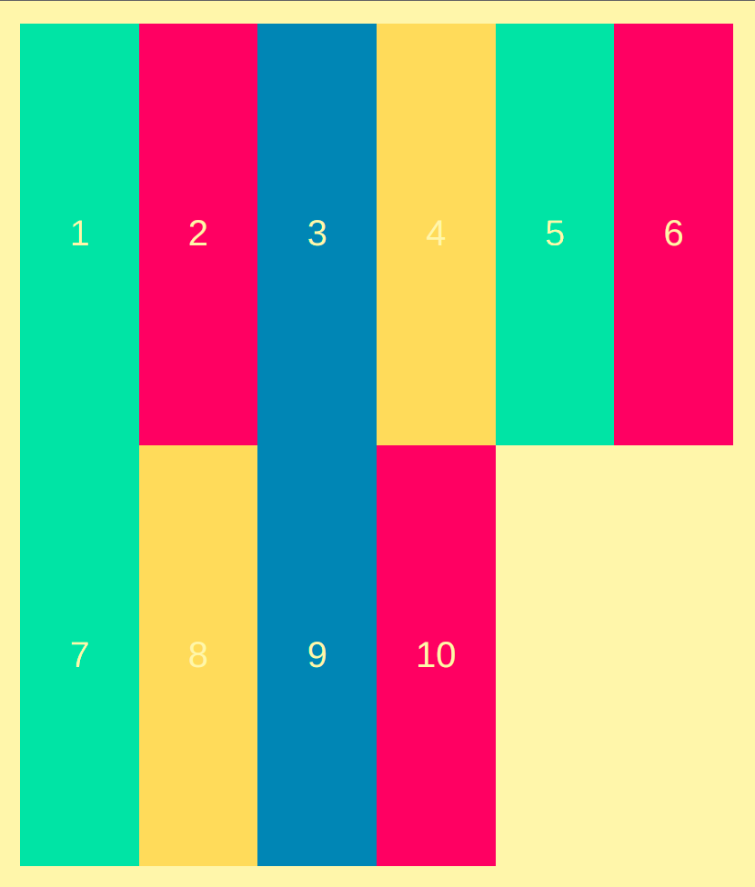

- If empty space is `>90px`, then replaced coming from down element

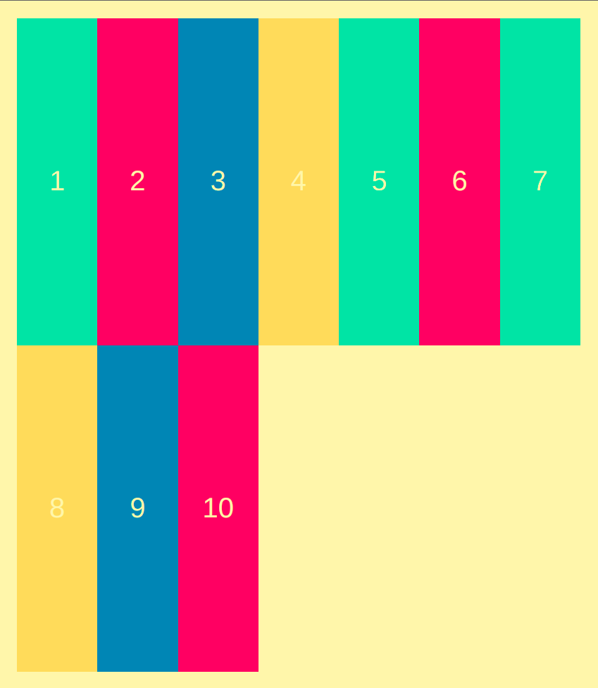

### Difference between `auto-fit` & `auto-fill`

- `auto-fit` replaces with element if found out free space otherwise expanding elements

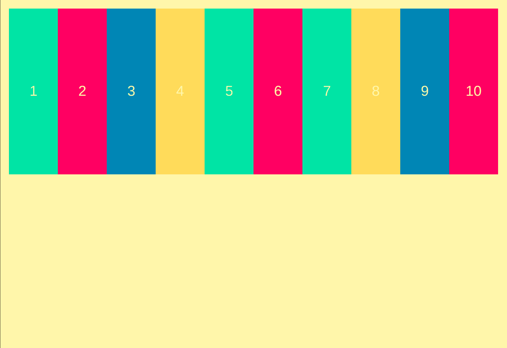

- `auto-fill` replaces with same sized empty element if found out free space otherwise expanding if there is some elements

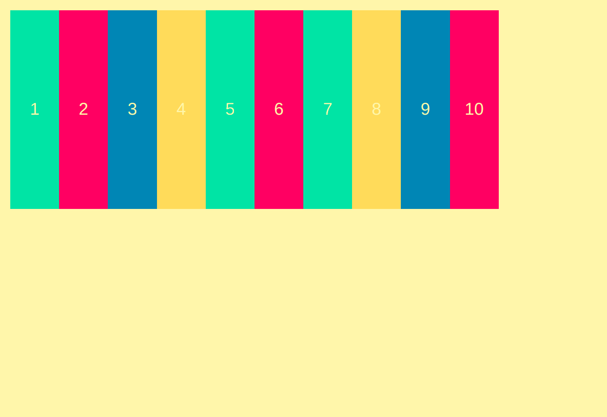

### Implicit Rows

- If I set 1st row but don't care about other rows

```css
.container {
  height: 100%;
  display: grid;
  grid-template-columns: repeat(auto-fill, minmax(90px, 1fr));
  grid-template-rows: repeat(1, 1fr);
}
```

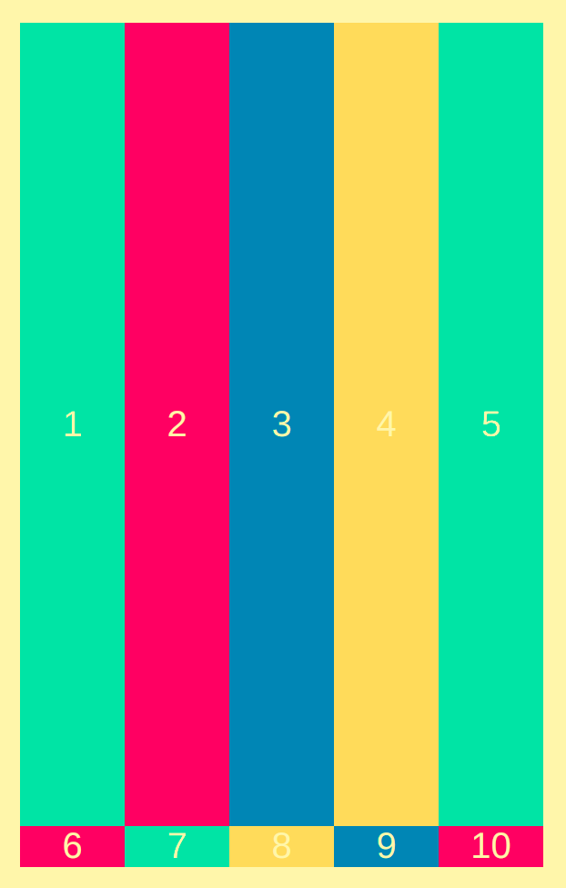

- But I can care about rest of the rows using `grid-auto-rows`
- Similarly I can also care about rest of the columns using `grid-auto-columns`

```css
.container {
  height: 100%;
  display: grid;
  grid-template-columns: repeat(auto-fill, minmax(90px, 1fr));
  grid-template-rows: repeat(1, 1fr);
  grid-auto-rows: 200px;
}
```

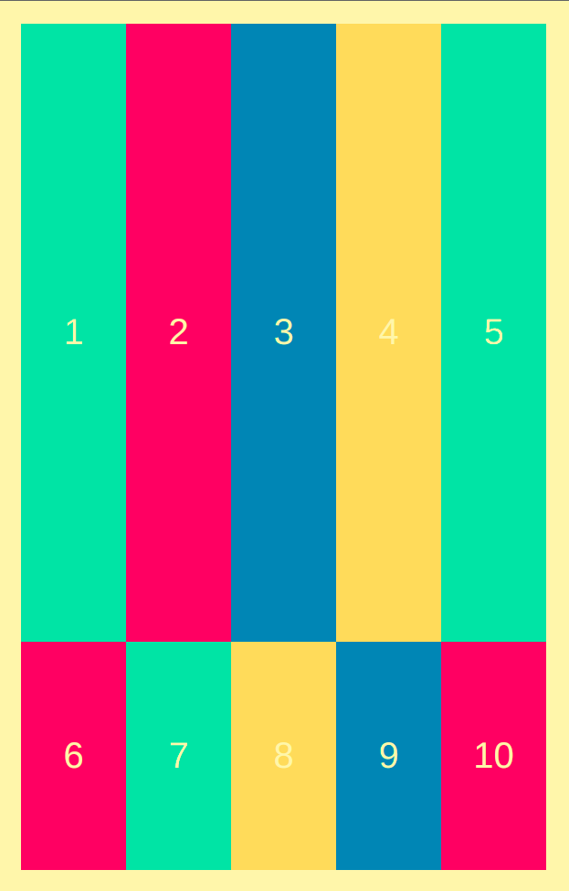

### `justify-content`

- Resizing browser, the content moves to the left
- Empty space creates to the right

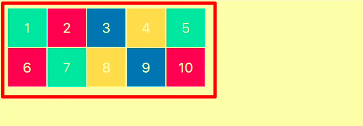

- Because -

```css
.container {
  height: 100%;
  display: grid;
  grid-template-columns: repeat(5, 90px);
  grid-template-rows: repeat(2, 90px);
  gap: 3px;
  justify-content: left; /* By default */
}
```

- Content move to the right -

```css
justify-content: right;
```

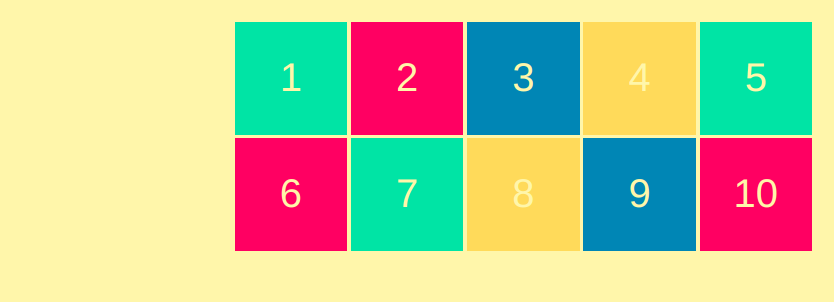

- Content move to the center -

```css
justify-content: center;
```

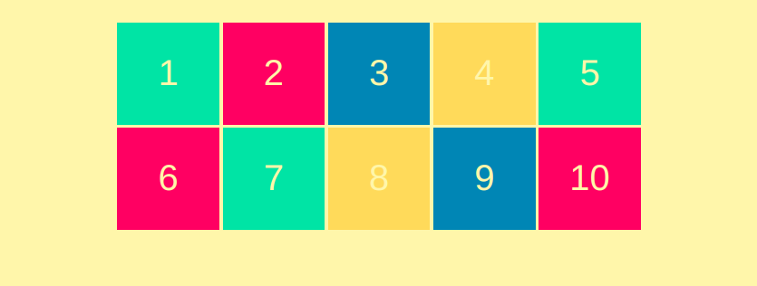

- Create responsive space in between the contents
- Spaces are equal

```css
justify-content: space-between;
```

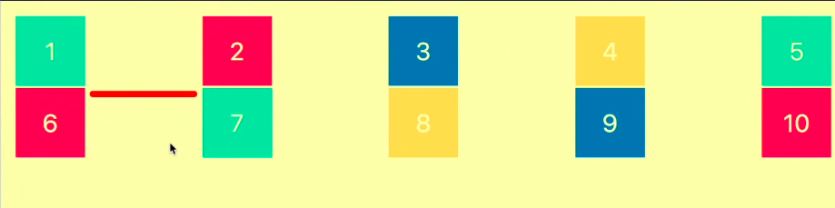

- Create responsive equal space each of the contents
- Spaces are equal

```css
justify-content: space-around;
```

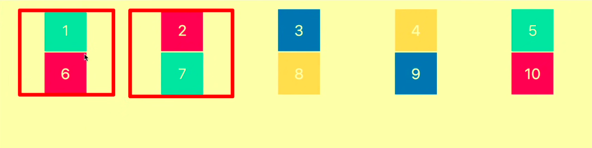

- Create responsive equal space in left & right of the contents
- Spaces are evenly equal

```css
justify-content: space-evenly;
```

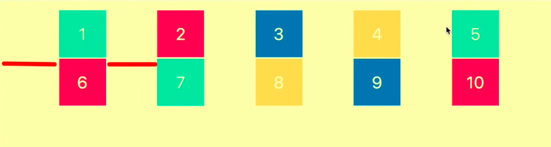

### `align-content`

- same property as `justify-content`

### `justify-items`

- same property as `justify-content`

### `align-items`

- same property as `justify-content`

### `justify-self`

- Apply content alignement in specific element
- In HTML -

```html
<div class="container">
  <div>1</div>
  <div>2</div>
  <div>3</div>
  <div>4</div>
  <div>5</div>
  <div>6</div>
  <div class="seven">7</div>
  <div>8</div>
  <div>9</div>
  <div>10</div>
</div>
```

```css
.container {
  height: 100%;
  display: grid;
  grid-template-columns: repeat(5, 90px);
  grid-template-rows: repeat(2, 90px);
  gap: 3px;
  justify-content: center;
  align-content: center;
}

.seven {
  justify-self: center;
}
```

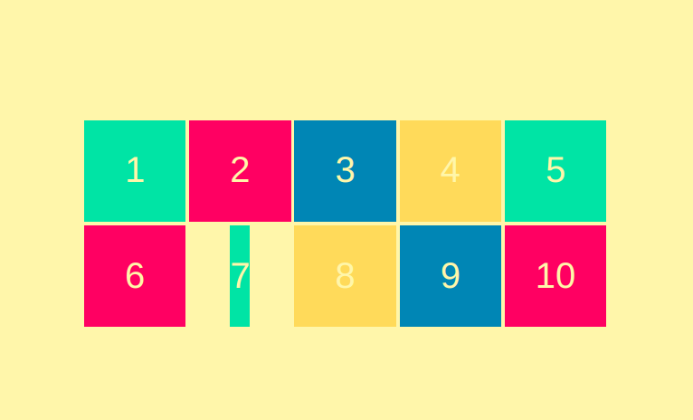
