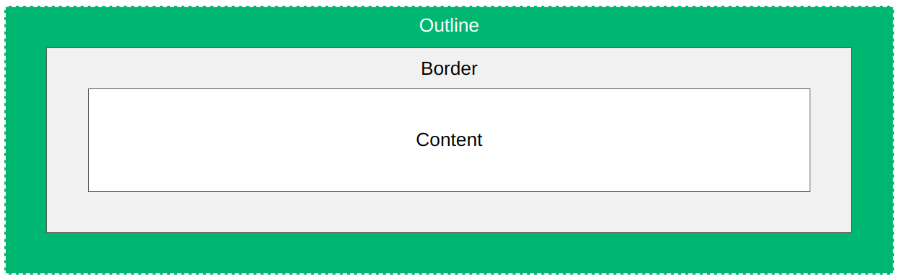
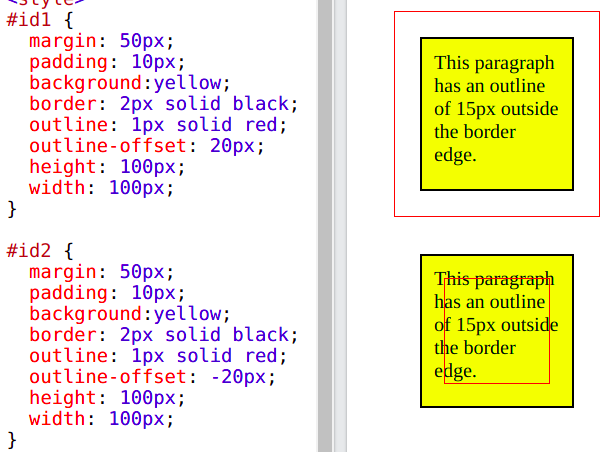
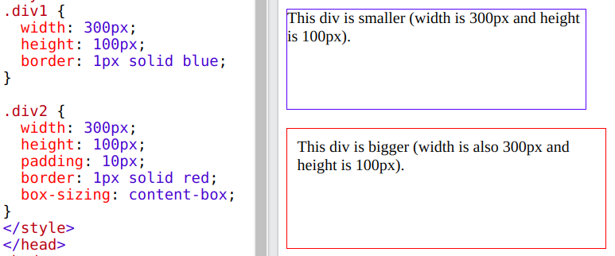
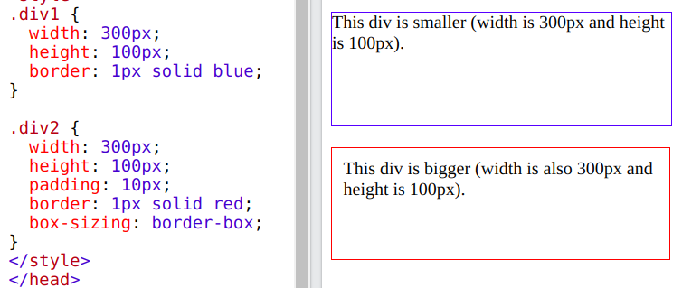
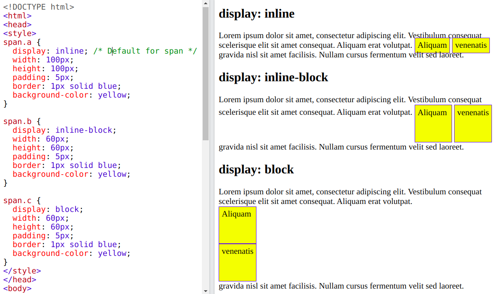
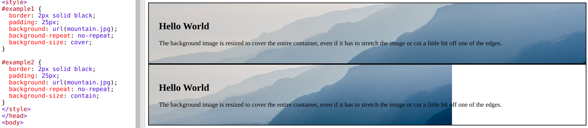

# CSS

## Typography

- `font-size` - size of the fonts
- `font-family` - describes the font of the element

```css
font-family: Verdana;
font-size: 50px;
```

- font-stack: If browser doesn't support first `font-family` then try to support next one and so on
- generic-family: at last I must pass it so that browser can support at least that type of `font-family`
- For example: `serif`, `sans-serif`, `cursive`, `fantasy`, `monospace`

```css
font-family: 'Segeo UI', Tahoma, Geneva, Verdana, sans-serif;
```

```css
font-family: 'Courier New', Courier, monospace;
```

### Google Fonts

- Use in HTML

```html
<!-- Google fonts -->
<link
  href="https://fonts.googleapis.com/css2?family=Roboto:ital,wght@0,400;0,700;1,400&display=swap"
  rel="stylesheet"
/>
```

- And use in CSS as well

```css
font-family: 'Roboto', sans-serif;
```

- Or I can import in CSS and use in CSS as well

```css
@import url('https://fonts.googleapis.com/css2?family=Roboto:ital,wght@0,400;0,700;1,400&display=swap');

body {
  font-family: 'Roboto', sans-serif;
}
```

- `font-weight` - how thick or thin characters in text should be, i.e. `bold`, `lighter`, `400` (default)
- `font-style` - sets font style for a text, i.e. `italic`, `normal` (default), `inherit`

```css
font-weight: 400;
font-style: italic;
```

- `text-align` - alignment of the text, i.e. `left` (default), `center`, `right`
- `text-indent` - indentation of the text, i.e. `30px`, `6rem`

```css
font-align: center;
font-indent: 40px; /* First line of the paragraph will be gone 40px right indent */
```

- `line-height` - height between two lines, i.e. `30px`, `2` (2 \* 16 (default `font-size`) = 32px), `1.2rem`

```css
body {
  font-size: 20px;
  line-height: 1.5; /* 20px * 1.5 = 30px */
}
```

- `letter-spacing` - space between two letters, i.e. `5px`, `0.5rem`
- `word-spacing` - space between two words, i.e. `5px`, `0.5rem`
- `text-decoration` - i.e. `none`, `underline` (default), `line-through` (cross the word)
- `text-transform` - i.e. `uppercase`, `capitalize`, `lowercase`, `none`, `inherit`

## CSS Box Model


### Padding

- Distance between content and edge of the element
- Specifies a padding in `px`, `rem`, `pt`, `cm`, etc.
- Single padding -

```css
padding-top: 5px;
padding-top: 10px;
padding-top: 15px;
padding-top: 20px;
```

- Combining all 4 -

```css
padding: 5px; /* If all 4 items are the same */
padding: 5px 10px; /* top-bottom right-left */
padding: 5px 10px 15px 20px; /* If all 4 items are the different */
```

### Margin

- Distance between element and the screen or element and the other element
- Specifies a margin in `px`, `rem`, `pt`, `cm`, etc.
- In browser, there has some default margin
- To get rid of -

```css
* {
  margin: 0;
}
```

- Single margin -

```css
margin-top: 5px;
margin-top: 10px;
margin-top: 15px;
margin-top: 20px;
```

- Combining all 4 -

```css
margin: 5px; /* If all 4 items are the same */
margin: 5rem 10px; /* top-bottom right-left */
margin: 5rem 10px 15px 20px; /* If all 4 items are the different */
```

## Border

- Specify the style, width and color of an element's border

```css
border-style: solid;
border-width: 10px;
border-color: blue;
```

- Shorthand -

```css
border: 1rem solid blue;
```

- `border-style` specifies what kind of border to display
- Like - `dotted`, `dashed`, `solid`, `double`, `none`, `hidden`, etc
- I can assign 4 sides for 4 styles

```css
border-top-style: dotted;
border-right-style: solid;
border-bottom-style: dotted;
border-left-style: solid;
```

- `border-width` specifies `px`, `rem`, `pt`, `cm`, etc.

```css
border-width: 5px 20px; /* 5px top and bottom, 20px on the sides */
border-width: 25px 10px 4px 35px; /* 25px top, 10px right, 4px bottom and 35px left */
border-width: 5px; /* If all 4 items are the same */
```

- `border-radius` -

```css
border-radius: 5px; /* All 4 corners are maintaining 5px */
```

- -ve `margin` - overlapping two elements

```css
margin-top: -50px;
```

- `outline` - outside the borders to make the element stand out

```css
outline-style: solid;
outline-width: 10px;
outline-color: blue;
```



- `outline-style` specifies the style of the outline
- Like - `dotted`, `dashed`, `solid`, `double`, `none`, `hidden`, etc
- I can assign 4 sides for 4 styles

```css
outline-width: 5px 20px; /* 5px top and bottom, 20px on the sides */
outline-width: 25px 10px 4px 35px; /* 25px top, 10px right, 4px bottom and 35px left */
outline-width: 5px; /* If all 4 items are the same */
```

- Shorthand

```css
outline: 5px solid blue;
```

- `outline-offset` - add space between an outline and the edge/border of an element
- The space between an element and its outline is transparent

```css
outline: 5px solid blue;
outline-offset: 10px;
```

- `outline-offset` could be +ve and -ve



## Display Property

- Elements have it set by default
- `block` - Always starts a new line and spans full width
- By default, `div`, `p` and `h1` are the example of `display: block` element
- I can change it as `display: inline`

```css
display: block;
```

- `inline` - Does not start a new line and spans only content
- By default, `span`, `a` and `img` are the example of `display: inline` element
- I can change it as `display: block`

```css
display: inline;
```

- I can set margin property to `auto` to horizontally (left to right) center the element within its container
- Remaining empty space will be split equally between the left and right

```css
margin: auto; /* Only mention left-right */
margin: 3rem auto; /* top-bottom: 3rem & left-right: auto */
margin-left: auto; /* Element move to right */
margin-right: auto; /* Element move to left */
```


- `block` - browser respects width/height, top/bottom margin
- `inline` - browser does not respect width/height, top/bottom margin

```css
div {
  background: blue;
  color: white;
  width: 300px;
  height: 200px;
  margin-top: 20px;
  margin-bottom: 200px;
}

span {
  background: blue;
  color: white;
  width: 300px; /* Not applicable for inline element 'span' */
  height: 200px; /* Not applicable for inline element 'span' */
  margin-top: 20px; /* Not applicable for inline element 'span' */
  margin-bottom: 200px; /* Not applicable for inline element 'span' */
}
```

### Descendant Selectors

- In HTML -

```html
<ul>
  <li><a href="#">home</a></li>
  <li><a href="#">about us</a></li>
  <li><a href="#">products</a></li>
  <li><a href="#">contact</a></li>
  <a href="#">testing</a>
</ul>
```

- Select all `li` -

```css
ul li {
  list-style-type: none; /* Remove dot-point style */
}
```

- Select all `a` inside `ul li` (more specific) -

```css
ul li a {
  color: black;
}
```

- Select all `a` inside `ul` -

```css
ul a {
  color: green;
}
```

- `box-sizing` - include the padding and border in an element's total width and height

```css
box-sizing: content-box; /* By default */
```



- By default, the width and height of an element is calculated like -
- width + padding + border = actual width of an element
- height + padding + border = actual height of an element
- So, Adding height/width of an element, shows bigger than I have set
- Because of element's border and padding are also added
- Actually, padding within the element

```css
box-sizing: border-box;
```

- Though add `10px` padding, the total width of the element does not increase



- `inline-block` - does not start a new line
- Browser respects margin, width, height
- Comparison among `inline`, `inline-block`, `block` -



- `none` - remove from the flow, hide element collapse the space

```css
display: none;
```

- `opacity: 0`, `visibility: hidden` - hides element preserves the space

```css
opacity: 0;
visibility: hidden;
```

- Difference is `disply: none` remove the element from the container, so next element will be replaced that space
- Others are not removed, but only off the element's visibility, so next element will not be replaced that space

## Background Images

- `background` - set a background image

```css
background: url("./big.jpeg")
background: url("./images/big.jpeg") /* Image in the folder */
```

- `background-repeat` - sets if/how a background image will be repeated

```css
background-repeat: repeat; /* By default repeat according x & y axis */
background-repeat: no-repeat;
background-repeat: repeat-x;
background-repeat: repeat-y;
background-repeat: space; /* Repeat with space in x & y axis */
background-repeat: round; /* If contains one more full image space then add else existing images will be increased adjusting width & height */
```

- `background-size` - specifies the size of the background images
- `background-size: cover` - resize the background image to cover the entire container
- `background-size: contain` - resize the background image to make sure the image is fully visible



- `background-position` - sets the starting position of a background image

```css
background-position: center;
background-position: left;
background-position: right;
background-position: bottom;
background-position: top;
background-position: 0 0; /* By default */
background-position: 10% 20%; /* X: 10%, Y: 20% */
```

- `background-attachment` - sets whether a background image scrolls with the rest of the page or is fixed

```css
background-attachment: scroll; /* By default */
background-attachment: fixed;
```

- `linear-gradient`

```css
background: linear-gradient(red, green); /* Can add more colors */
background: linear-gradient(to bottom, red, green); /* By default: to bottom */
background: linear-gradient(315deg, red, green);
background: linear-gradient(to top right, red, green);
background: linear-gradient(red 20%, green 70%); /* 20% & 70% dark */
background: linear-gradient(rgba(0, 0, 0, 0.2), rgba(0, 0, 0, 0.9));
```

- Background image overlay - add a shadow-like image over the background image

```css
background: liner-gradient(rgba(0, 0, 0, 0.5), rgba(0, 0, 0, 0.5)),
  url('./big/jpeg');
```

- Overall `background` properties are -

```css
background: liner-gradient(rgba(0, 0, 0, 0.5), rgba(0, 0, 0, 0.5)),
  url('./big/jpeg');
background-position: center;
background-size: cover;
background-repeat: no-repeat;
background-attachment: fixed;
```

- Combining `background` properties -

```css
background: liner-gradient(rgba(0, 0, 0, 0.5), rgba(0, 0, 0, 0.5)),
  url('./big/jpeg') center/cover no-repeat fixed;
```

- Alternate way - 

```css
background: liner-gradient(rgba(0, 0, 0, 0.5), rgba(0, 0, 0, 0.5)),
  url('./big/jpeg') center/cover fixed no-repeat;
```

- Don't alternate `cover/center`, it won't work
- For generate linear gradient, I can visit [ColorZilla](https://www.colorzilla.com/gradient-editor/)

## CSS Property

- `float` - is used for positioning and formatting content
- `float` property can be used to wrap text around images

```css
float: left;
float: right;
float: none; /* By default */
float: inherit;
```

- `clear` - specifies what should happen with the element that is next to a floating element

```css
clear: left;
clear: right;
clear: none; /* By default */
clear: both; /*  */
clear: inherit;
```

- If an element is floated to the left, then I should clear to the left

https://www.w3schools.com/css/css_float.asp
https://www.w3schools.com/css/css_float_clear.asp
take ss - https://www.w3schools.com/css/tryit.asp?filename=trycss_layout_clear
