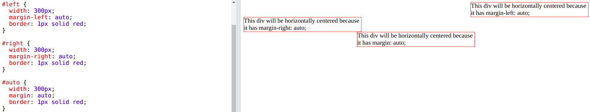
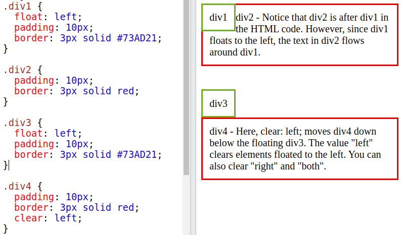

# CSS

## Typography

- `font-size` - size of the fonts
- `font-family` - describes the font of the element

```css
font-family: Verdana;
font-size: 50px;
```

- font-stack: If browser doesn't support first `font-family` then try to support next one and so on
- generic-family: at last I must pass it so that browser can support at least that type of `font-family`
- For example: `serif`, `sans-serif`, `cursive`, `fantasy`, `monospace`

```css
font-family: 'Segeo UI', Tahoma, Geneva, Verdana, sans-serif;
```

```css
font-family: 'Courier New', Courier, monospace;
```

### Google Fonts

- Use in HTML

```html
<!-- Google fonts -->
<link
  href="https://fonts.googleapis.com/css2?family=Roboto:ital,wght@0,400;0,700;1,400&display=swap"
  rel="stylesheet"
/>
```

- And use in CSS as well

```css
font-family: 'Roboto', sans-serif;
```

- Or I can import in CSS and use in CSS as well

```css
@import url('https://fonts.googleapis.com/css2?family=Roboto:ital,wght@0,400;0,700;1,400&display=swap');

body {
  font-family: 'Roboto', sans-serif;
}
```

- `font-weight` - how thick or thin characters in text should be, i.e. `bold`, `lighter`, `400` (default)
- `font-style` - sets font style for a text, i.e. `italic`, `normal` (default), `inherit`

```css
font-weight: 400;
font-style: italic;
```

- `text-align` - alignment of the text, i.e. `left` (default), `center`, `right`
- `text-indent` - indentation of the text, i.e. `30px`, `6rem`

```css
font-align: center;
font-indent: 40px; /* First line of the paragraph will be gone 40px right indent */
```

- `line-height` - height between two lines, i.e. `30px`, `2` (2 \* 16 (default `font-size`) = 32px), `1.2rem`

```css
body {
  font-size: 20px;
  line-height: 1.5; /* 20px * 1.5 = 30px */
}
```

- `letter-spacing` - space between two letters, i.e. `5px`, `0.5rem`
- `word-spacing` - space between two words, i.e. `5px`, `0.5rem`
- `text-decoration` - i.e. `none`, `underline` (default), `line-through` (cross the word)
- `text-transform` - i.e. `uppercase`, `capitalize`, `lowercase`, `none`, `inherit`

## CSS Box Model


### Padding

- Distance between content and edge of the element
- Specifies a padding in `px`, `rem`, `pt`, `cm`, etc.
- Single padding -

```css
padding-top: 5px;
padding-top: 10px;
padding-top: 15px;
padding-top: 20px;
```

- Combining all 4 -

```css
padding: 5px; /* If all 4 items are the same */
padding: 5px 10px; /* top-bottom right-left */
padding: 5px 10px 15px 20px; /* If all 4 items are the different */
```

### Margin

- Distance between element and the screen or element and the other element
- Specifies a margin in `px`, `rem`, `pt`, `cm`, etc.
- In browser, there has some default margin
- To get rid of -

```css
* {
  margin: 0;
}
```

- Single margin -

```css
margin-top: 5px;
margin-top: 10px;
margin-top: 15px;
margin-top: 20px;
```

- Combining all 4 -

```css
margin: 5px; /* If all 4 items are the same */
margin: 5rem 10px; /* top-bottom right-left */
margin: 5rem 10px 15px 20px; /* If all 4 items are the different */
```

## Border

- Specify the style, width and color of an element's border

```css
border-style: solid;
border-width: 10px;
border-color: blue;
```

- Shorthand -

```css
border: 1rem solid blue;
```

- `border-style` specifies what kind of border to display
- Like - `dotted`, `dashed`, `solid`, `double`, `none`, `hidden`, etc
- I can assign 4 sides for 4 styles

```css
border-top-style: dotted;
border-right-style: solid;
border-bottom-style: dotted;
border-left-style: solid;
```

- `border-width` specifies `px`, `rem`, `pt`, `cm`, etc.

```css
border-width: 5px 20px; /* 5px top and bottom, 20px on the sides */
border-width: 25px 10px 4px 35px; /* 25px top, 10px right, 4px bottom and 35px left */
border-width: 5px; /* If all 4 items are the same */
```

- `border-radius` -

```css
border-radius: 5px; /* All 4 corners are maintaining 5px */
```

- -ve `margin` - overlapping two elements

```css
margin-top: -50px;
```

- `outline` - outside the borders to make the element stand out

```css
outline-style: solid;
outline-width: 10px;
outline-color: blue;
```


- `outline-style` specifies the style of the outline
- Like - `dotted`, `dashed`, `solid`, `double`, `none`, `hidden`, etc
- I can assign 4 sides for 4 styles

```css
outline-width: 5px 20px; /* 5px top and bottom, 20px on the sides */
outline-width: 25px 10px 4px 35px; /* 25px top, 10px right, 4px bottom and 35px left */
outline-width: 5px; /* If all 4 items are the same */
```

- Shorthand

```css
outline: 5px solid blue;
```

- `outline-offset` - add space between an outline and the edge/border of an element
- The space between an element and its outline is transparent

```css
outline: 5px solid blue;
outline-offset: 10px;
```

- `outline-offset` could be +ve and -ve


## Display Property

- Elements have it set by default
- `block` - Always starts a new line and spans full width
- By default, `div`, `p` and `h1` are the example of `display: block` element
- I can change it as `display: inline`

```css
display: block;
```

- `inline` - Does not start a new line and spans only content
- By default, `span`, `a` and `img` are the example of `display: inline` element
- I can change it as `display: block`

```css
display: inline;
```

- I can set margin property to `auto` to horizontally (left to right) center the element within its container
- Remaining empty space will be split equally between the left and right

```css
margin: auto; /* Only mention left-right */
margin: 3rem auto; /* top-bottom: 3rem & left-right: auto */
margin-left: auto; /* Element move to right */
margin-right: auto; /* Element move to left */
```



- `block` - browser respects width/height, top/bottom margin
- `inline` - browser does not respect width/height, top/bottom margin

```css
div {
  background: blue;
  color: white;
  width: 300px;
  height: 200px;
  margin-top: 20px;
  margin-bottom: 200px;
}

span {
  background: blue;
  color: white;
  width: 300px; /* Not applicable for inline element 'span' */
  height: 200px; /* Not applicable for inline element 'span' */
  margin-top: 20px; /* Not applicable for inline element 'span' */
  margin-bottom: 200px; /* Not applicable for inline element 'span' */
}
```

### Descendant Selectors

- In HTML -

```html
<ul>
  <li><a href="#">home</a></li>
  <li><a href="#">about us</a></li>
  <li><a href="#">products</a></li>
  <li><a href="#">contact</a></li>
  <a href="#">testing</a>
</ul>
```

- Select all `li` -

```css
ul li {
  list-style-type: none; /* Remove dot-point style */
}
```

- Select all `a` inside `ul li` (more specific) -

```css
ul li a {
  color: black;
}
```

- Select all `a` inside `ul` -

```css
ul a {
  color: green;
}
```

- `box-sizing` - include the padding and border in an element's total width and height

```css
box-sizing: content-box; /* By default */
```


- By default, the width and height of an element is calculated like -
- width + padding + border = actual width of an element
- height + padding + border = actual height of an element
- So, Adding height/width of an element, shows bigger than I have set
- Because of element's border and padding are also added
- Actually, padding within the element

```css
box-sizing: border-box;
```

- Though add `10px` padding, the total width of the element does not increase


- `inline-block` - does not start a new line
- Browser respects margin, width, height
- Comparison among `inline`, `inline-block`, `block` -


- `none` - remove from the flow, hide element collapse the space

```css
display: none;
```

- `opacity: 0`, `visibility: hidden` - hides element preserves the space

```css
opacity: 0;
visibility: hidden;
```

- Difference is `disply: none` remove the element from the container, so next element will be replaced that space
- Others are not removed, but only off the element's visibility, so next element will not be replaced that space

## Background Images

- `background` - set a background image

```css
background: url("./big.jpeg")
background: url("./images/big.jpeg") /* Image in the folder */
```

- `background-repeat` - sets if/how a background image will be repeated

```css
background-repeat: repeat; /* By default repeat according x & y axis */
background-repeat: no-repeat;
background-repeat: repeat-x;
background-repeat: repeat-y;
background-repeat: space; /* Repeat with space in x & y axis */
background-repeat: round; /* If contains one more full image space then add else existing images will be increased adjusting width & height */
```

- `background-size` - specifies the size of the background images
- `background-size: cover` - resize the background image to cover the entire container
- `background-size: contain` - resize the background image to make sure the image is fully visible


- `background-position` - sets the starting position of a background image

```css
background-position: center;
background-position: left;
background-position: right;
background-position: bottom;
background-position: top;
background-position: 0 0; /* By default */
background-position: 10% 20%; /* X: 10%, Y: 20% */
```

- `background-attachment` - sets whether a background image scrolls with the rest of the page or is fixed

```css
background-attachment: scroll; /* By default */
background-attachment: fixed;
```

- `linear-gradient`

```css
background: linear-gradient(red, green); /* Can add more colors */
background: linear-gradient(to bottom, red, green); /* By default: to bottom */
background: linear-gradient(315deg, red, green);
background: linear-gradient(to top right, red, green);
background: linear-gradient(red 20%, green 70%); /* 20% & 70% dark */
background: linear-gradient(rgba(0, 0, 0, 0.2), rgba(0, 0, 0, 0.9));
```

- Background image overlay - add a shadow-like image over the background image

```css
background: liner-gradient(rgba(0, 0, 0, 0.5), rgba(0, 0, 0, 0.5)),
  url('./big/jpeg');
```

- Overall `background` properties are -

```css
background: liner-gradient(rgba(0, 0, 0, 0.5), rgba(0, 0, 0, 0.5)),
  url('./big/jpeg');
background-position: center;
background-size: cover;
background-repeat: no-repeat;
background-attachment: fixed;
```

- Combining `background` properties -

```css
background: liner-gradient(rgba(0, 0, 0, 0.5), rgba(0, 0, 0, 0.5)),
  url('./big/jpeg') center/cover no-repeat fixed;
```

- Alternate way -

```css
background: liner-gradient(rgba(0, 0, 0, 0.5), rgba(0, 0, 0, 0.5)),
  url('./big/jpeg') center/cover fixed no-repeat;
```

- Don't alternate `cover/center`, it won't work
- For generate linear gradient, I can visit [ColorZilla](https://www.colorzilla.com/gradient-editor/)

## CSS Property

- `float` - is used for positioning and formatting content
- `float` property can be used to wrap text around images

```css
float: left;
float: right;
float: none; /* By default */
float: inherit;
```

- `clear` - specifies what should happen with the element that is next to a floating element

```css
clear: left;
clear: right;
clear: none; /* By default */
clear: both; /* Clear both left & right */
clear: inherit;
```

- If an element is floated to the left, then I should clear to the left



### Position

- specifies the type of positioning method used for an element (`static`, `relative`, `fixed`, `absolute` or `sticky`)
- `static` - default, always positioned according to the normal flow
- [`static` Example](https://www.w3schools.com/css/tryit.asp?filename=trycss_position_static)

```css
position: static;
```

- `relative` - position relative to it's normal position
- While using `relative`, must use `top`, `bottom`, `left` & `right`
- [`relative` Example](https://www.w3schools.com/css/tryit.asp?filename=trycss_position_relative)

```css
position: relative;
left: 200px;
```

- `absolute` - relative to the nearest positioned ancestor with `position: relative`
- [`absolute` Example](https://www.w3schools.com/css/tryit.asp?filename=trycss_position_absolute)

```css
/* Parent */
div {
  position: relative;
}

/* Child */
p {
  position: absolute;
  top: 0;
  left: 0;
}
```

- `fixed` - relative to viewport (screen), stays as wer are scrolling
- Will use other content to fill out the space
- [`fixed` Example](https://www.w3schools.com/css/tryit.asp?filename=trycss_position_fixed)

```css
position: fixed;
top: 0;
left: 0;
```

- `sticky` - toggles between relative and fixed once the position is met in the viewport, then it sticks
- One of the values `top`, `bottom`, `left` & `right`
- [`sticky` Example](https://www.w3schools.com/css/tryit.asp?filename=trycss_position_sticky)

```css
position: sticky;
top: 10px; /* From top, takes 10px gap and stays 'sticky' while scrolling */
```

## Media Queries

- Responsive design
- Style elements on different screen sizes
- `min-width` - starting from
- `max-width` - up to

```css
body {
  background: yellow;
  text-decoration: underline;
}

/* And more on */

/* This responsive design applicable from 576px */
@media screen and (min-width: 576px) {
  body {
    background: red;
    /* text-decoration: underline; */
    /* If I don't change any existing property value, it will remain same */
  }

  /* And more on */
}

/* This responsive design applicable up to 768px */
@media screen and (max-width: 768px) {
  body {
    background: red;
    /* text-decoration: underline; */
    /* If I don't change any existing property value, it will remain same */
  }

  /* And more on */
}
```

## Z-index

- z-index - z-axis
- Default - `0`
- Does not work on `position: static`
- Specifies the stack order of an element
- An element with greater stack order is always in front of an element with a lower stack order

```css
position: relative;
left: 0px;
top: 0px;
z-index: 1; /* Move to the top of all overlapped element */
```

## Pseudo-elements

- `::before`, `::after` - pseudo-elements creates element and inserts before and after the content
- `content:''` - required, insert text & image too
- `img` - does not work, so cover `img` with `div` and apply pseudo-element over `div`
- It's by default `display: inline-block`


- If I use `content: ''`, nothing will show & other CSS properties are not worked
- Must use the following properties together, otherwise nothing will show -

```css
content: '';
display: block;
width: 100%; /* Can customize */
height: 20px; /* Can customize */
```

## More Selectors

### Basic Selectors

- Universal selector -

```css
* {
  color: red;
}
```

- Id selector -

```css
#heading {
  color: red;
}
```

- Class selector -

```css
.heading {
  color: red;
}
```

- Tag selector -

```css
p {
  color: red;
}
```

### Descendant and Child Selectors

- In HTML -

```html
<div>
  <h1>I'm a child and descendant</h1>
  <!-- Immediate child -->
</div>

<div>
  <h1>I'm a child and descendant</h1>
  <!-- Immediate child -->
  <ul>
    <li>
      <h1>I'm a descendant</h1>
    </li>
  </ul>
</div>
```

- In CSS -

```css
/* All 'h1' inside 'div' -> mark all 'h1' */
div h1 {
  color: red;
}

.header h1 {
} /* Using class selector */

/* Mark direct (immediate) child 'h1' inside parent 'div' */
div > h1 {
  color: green;
}

.header > h1 {
} /* Using class selector */
```

- `::first-line`, `::first-letter`
- In HTML -

```html
<p>
  Lorem Ipsum is simply dummy text of the printing and typesetting industry.
  Lorem Ipsum has been the industry's standard dummy text ever since the 1500s,
  when an unknown printer took a galley of type and scrambled it to make a type
  specimen book.
</p>
```

```css
p::first-line {
  /* Modify the first line of the paragraph */
  font-weight: bold;
}

p::first-letter {
  /* Modify the first letter of the paragraph */
  font-size: 150%;
}
```

- `:hover` (pseudo class)
- Activate when hovering the mouse of the element

```css
/* With tag selector */
div:hover {
}

/* With id selector */
#heading:hover {
}

/* With class selector */
.heading:hover {
}
```

- `:link` - unvisited links with href

```css
a:link {
  color: red;
  background: grey;
}
```

- `:visited` - visited links

```css
a:visited {
  color: red;
  background: grey;
}
```

- `:hover` - hover using mouse

```css
a:hover {
  color: red;
  background: grey;
}
```

- `:active` - as the user clicks

```css
a:active {
  color: red;
  background: grey;
}
```

- `a` - all links

```css
a {
  color: red;
  background: grey;
}
```

- `:root` - root element of the document, higher specificity
- HTML element
- General styles
- CSS variables
- Change the browser default `font-size` using `:root` (pseudo element)

```css
:root {
  font-size: 10px; /* Default was 16px */
}
```

## Animation Property

### Transform

- Modify the object or element
- `transform: translate()` - Move the element according X & Y axis

```css
transform: translate(30px, 50px); /* X = 30px & Y = 50px */
transform: translateX(-30px); /* X = -30px only */
transform: translateY(-50px); /* Y = -50px only */
transform: translateY(
  50%
); /* Y = parent of 50%, If parent width = 100px then Y = 50px */
```

- `transform: scale()` - Increase the size of the element according X & Y axis

```css
transform: scale(2); /* X = 2 * parent height & Y = 2 * parent width */
transform: scale(
  1.2,
  1.5
); /* X = 1.2 * parent height & Y = 1.5 * parent width */
transform: scaleX(1.5); /* X = 1.5 * parent height only */
transform: scaleY(1.2); /* Y = 1.2 * parent width only */
```

- `transform: rotate()` - Rotate the element X, Y, Z axis

```css
transform: rotate(20deg); /* Z = 20deg or clock-wise */
transform: rotate(-20deg); /* Z = -20deg or anti clock-wise */
```

- Same as

```css
transform: rotateZ(20deg);
transform: rotateZ(20deg);
```

- Also applicable but can't view in 2D object
- Must use 3D object

```css
transform: rotateX(20deg);
transform: rotateY(20deg);
```

- `transform: rotate()`

```css
transform: skew(40deg, 50deg);
transform: skewX(40deg);
transform: skewY(50deg);
```

### Transition

- Change over time
- `transition-property` - which property I want to add transition
- `transition-duration` - how many time to take that change

```css
div:hover {
  background: coral;
}

div {
  height: 150px;
  width: 150px;
  background: green;
  transition-property: background; /* Select the property */
  transition-duration: 4s; /* Duration */
}
```

- Add multiple property

```css
transition-property: background, border-radius;
transition-duration: 4s; /* Both transition will take 4s */
```

- Add different duration time

```css
transition-property: background, border-radius;
transition-duration: 4s, 2s; /* background and border-radius will take 4s and 2s respectively */
```

- `transition-delay` - waits and after that start changing

```css
transition-property: background, border-radius;
transition-duration: 4s; /* Both transition will take 4s */
transition-delay: 2s; /* Wait 2s, then start the transition */
```

- Shorthand -

```css
transition: transition-property transition-duration transition-delay;
```

- For example -

```css
div {
  height: 150px;
  width: 150px;
  background: green;
  transition: background 2s 1s, border-radius 3s 2s; /* Not cover - 'scale' */
}

div:hover {
  background: coral;
  border-radius: 50%;
  transform: scale(1.2);
}
```

- Cover all CSS property

```css
div {
  height: 150px;
  width: 150px;
  background: green;
  transition: all 2s 1s; /* Ignoring 'delay' - all 2s; */
}
```

- `transition-timing-function` - the behaviour of the transition

```css
transition: transition-property transition-duration transition-timing-function
  transition-delay;

/* Like */
transition: all 3s transition-timing-function 2s;
```

- `ease` - slow start, fast, slow end (by default)
- `linear` - same speed start to end
- `ease-in` - slow start
- `ease-out` - slow end
- `ease-in-out` - gently slow start, fast, gently slow end
- The key difference between `ease-in-out` begins and ends more gradually, creating a more gentle start and finish compared to `ease`

## Animation

- Transition 0 - 100% direct (from start to end state)
- Amination 0 1% 2% .... 100% gradually (multiple states)

```css
div {
  height: 150px;
  width: 150px;
  background: green;

  /* Animation property */
  animation-name: move;
  animation-duration: 10s;
  animation-iteration-count: 2; /* How many time the animation take place */
}

@keyframes move {
  0% {
    transform: translateX(20px);
    background: red;
  }

  50% {
    transform: translateX(40px);
    background: red;
  }

  100% {
    transform: translateX(-40px);
    background: red;
  }
}
```

- Shorthand -

```css
animation: animation-name animation-duration animation-iteration-count;
```

- For example:

```css
animation: move 10s infinite;
```

- `animation-fill-mode` - what values are applied by the animation outside the time it is executing

```css
animation-fill-mode: forwards; /* Stay in last applied animation */
```

## CSS Variables (Custom Properties)

- Hold a value and reuse it
- Assign - `--varName: value`
- Use - `property: var(--varName)`
- Applied in any property
- Ignore multiple use of any value of a property
- Scope -
- In `:root{}` === global

```css
:root {
  --primaryColor: #1313fa;
  --mainTransition: all 0.4s linear;
}

.heading {
  color: var(--primaryColor);
}

.heading2 {
  color: var(--primaryColor);
  transition: var(mainTransition);
}
```

- In element === local
- Only accessable inside the child element

```css
div {
  --primaryRed: red;
}

.main-text {
  color: var(--primaryRed);
}
```